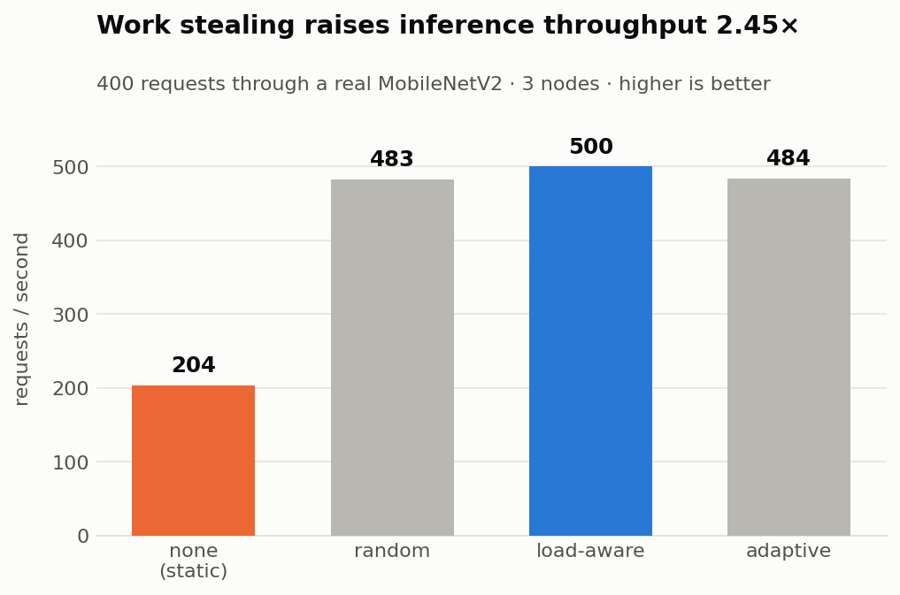
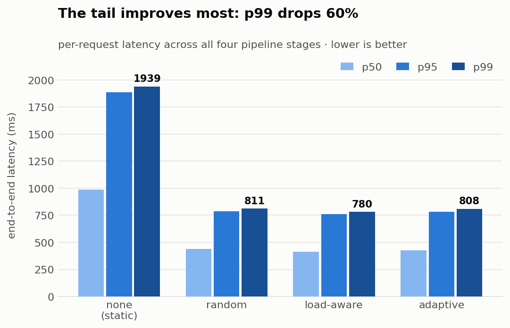
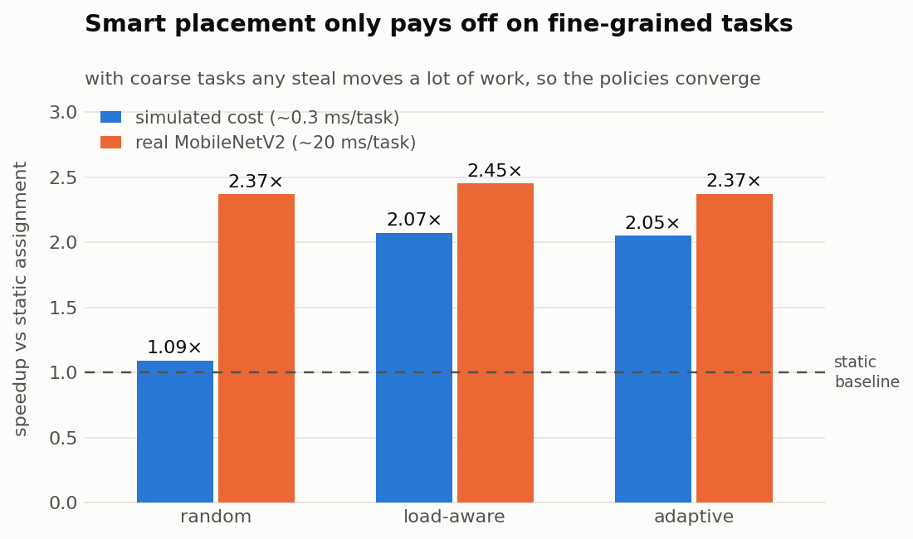
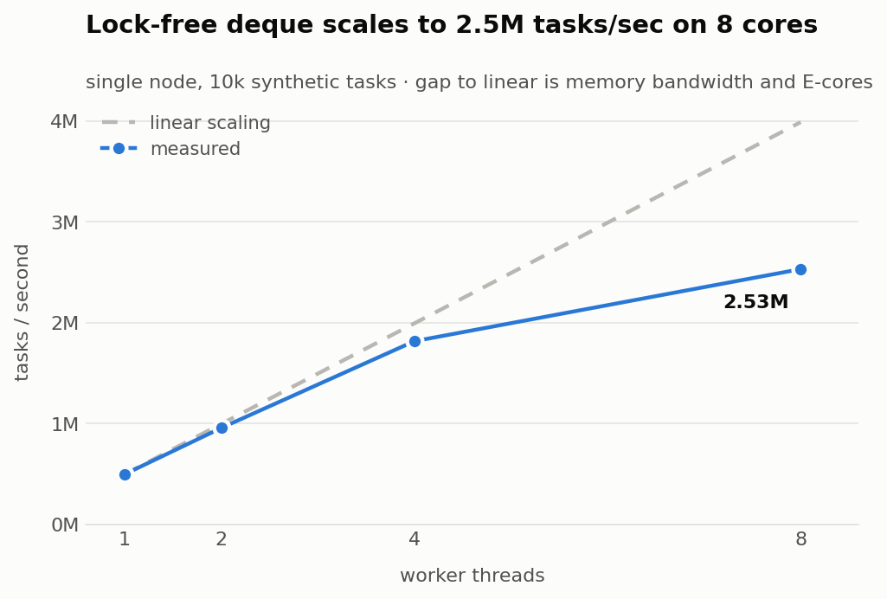

# HydraRT

A distributed work-stealing runtime in C++20, and a distributed ML inference engine
built on top of it to prove the scheduling is worth having.

Requests are spread across worker threads and across machines. When one node falls
behind, idle nodes take work off it over TCP. On a real MobileNetV2 workload that is
worth **2.45× throughput and 60% lower p99 latency** compared to assigning work up
front and leaving it there.

<picture>
  <source media="(prefers-color-scheme: dark)" srcset="docs/img/throughput-dark.png">
  
</picture>

---

## The problem

If every unit of work costs the same, scheduling is trivial — deal the work out evenly
and stop thinking about it. Real inference is not like that:

- A 1024-token transformer request costs **~130× more** than a 64-token one, because
  attention is quadratic in sequence length.
- A 1024×1024 image costs far more to preprocess than a thumbnail.
- You cannot tell which is which until you run it.

So any up-front split is wrong, and the machine that drew the expensive requests ends
up grinding while its neighbours sit idle. This project is about fixing that *while
the work is running* rather than trying to predict it.

## How it works

```
        client                                    ┌──────────────┐
          │  POST /infer?model=text&seq=512       │ Coordinator  │
          ▼                                       │ membership   │
   ┌─────────────┐                                │ + heartbeats │
   │ HTTP API    │                                └──────┬───────┘
   └──────┬──────┘                                       │ who exists?
          ▼                                              │
   ┌─────────────┐   4-stage chain                       │
   │ JobManager  │   decode → preprocess → infer → post   │
   └──────┬──────┘                                        │
          ▼                                               │
   ┌────────────────────────────────────────────┐         │
   │ Runtime                                    │◄────────┘
   │  per-worker Chase-Lev deques (lock-free)   │
   │  injection queues (external submits)       │
   │  portable-task pools (one per task type)   │
   └────────────────┬───────────────────────────┘
                    │ remote steal over TCP
      ┌─────────────┼─────────────┐
      ▼             ▼             ▼
  ┌────────┐   ┌────────┐   ┌────────┐
  │ node A │   │ node B │   │ node C │
  │  cpu   │   │  gpu   │   │  cpu   │
  └────────┘   └────────┘   └────────┘
```

**Work stealing.** Each worker thread owns a queue. When it empties, it takes work from
a busy peer instead of idling. Within a process this uses a lock-free Chase-Lev deque —
the owner pushes and pops one end without any lock, thieves take the other end with a
compare-and-swap.

**Across machines.** A `std::function` cannot cross a network: it is type-erased code
holding pointers into one process's memory. So a task has two forms — a closure for the
fast local path, or a **type tag plus a byte payload** for anything that might travel.
Every node registers the same handler table, so the wire only carries a tag and bytes.

**Pipelines without blocking.** A request is a chain, not a fork-join. Each stage
submits its successor when it finishes rather than parking a thread on a future, so a
request in flight occupies **no thread at all** while it waits. That is what lets a
handful of workers carry far more concurrent requests than there are threads.

**Failure.** A node records every task it hands out. If no result comes back in time, it
re-runs the task itself. Without this, a peer that dies after taking work hangs the
origin forever. Semantics are at-least-once.

---

## Results

All measured on one 8-core Apple M2, three node processes over loopback.
Raw output is in [`results/`](results/).

### Scheduling policy comparison — real MobileNetV2

400 requests, best of 3. Any node may execute any stage.

| policy | throughput | p50 | p95 | p99 | stages moved |
|---|---:|---:|---:|---:|---:|
| `none` (static) | 204 req/s | 986 ms | 1884 ms | 1939 ms | 0 |
| `random` | 483 req/s | 441 ms | 787 ms | 811 ms | 326 |
| **`load-aware`** | **500 req/s** | **412 ms** | **761 ms** | **780 ms** | 323 |
| `adaptive` | 484 req/s | 428 ms | 784 ms | 808 ms | 325 |

<picture>
  <source media="(prefers-color-scheme: dark)" srcset="docs/img/latency-dark.png">
  
</picture>

The tail benefits most, which is the point: the p99 request is the one that got stuck
behind expensive work on a busy node, and that is exactly what stealing rescues.

### Task granularity decides whether a clever policy is worth it

<picture>
  <source media="(prefers-color-scheme: dark)" srcset="docs/img/granularity-dark.png">
  
</picture>

On the simulated workload (~0.3 ms/task) picking a good victim matters enormously —
random stealing gets 1.09× while load-aware gets 2.07×. With real model execution
(~20 ms/task) all three converge, because any steal now moves a large amount of work.
**Sophisticated placement earns its keep on fine-grained tasks; on coarse ones simply
not being idle dominates.**

### Single-node scaling

<picture>
  <source media="(prefers-color-scheme: dark)" srcset="docs/img/scaling-dark.png">
  
</picture>

Replacing a mutex-guarded queue with the lock-free deque removed a throughput plateau
where 4 and 8 workers performed identically. The remaining gap to linear is memory
bandwidth and the M2's efficiency cores.

---

## Running it

Requires CMake ≥ 3.20 and a C++20 compiler.

```bash
git clone https://github.com/SaahilM06/distributed-work-stealer.git
cd distributed-work-stealer
make            # builds into build/
```

### Tests

```bash
make test
```

Builds a **separate Debug configuration** and runs all five suites there. This matters:
CMake defines `-DNDEBUG` for Release and RelWithDebInfo, which deletes every `assert()`
along with any side effect inside it — so the tests use a `CHECK()` macro that always
evaluates, and the Debug build also enables ThreadSanitizer to catch data races in the
lock-free code.

### Single-node benchmark

```bash
make bench      # throughput, tracing overhead, latency percentiles
```

### A local cluster

```bash
./scripts/run_cluster.sh 3 4000 200000            # 3 nodes, 4000 tasks
./scripts/run_cluster.sh 3 4000 200000 --no-stealing   # the static baseline
WORKERS=2 ./scripts/run_cluster.sh 3 4000 200000       # 2 workers per node
```

### The inference engine over HTTP

```bash
./build/hydra_coordinator --port 9000 &
./build/hydra_inference --coordinator-port 9000 --http-port 8080 \
                        --workers 4 --label gpu --seconds 120 &

curl -X POST "http://127.0.0.1:8080/infer?model=text&seq=512"
# {"request_id":1,"model":"text"}

curl "http://127.0.0.1:8080/status?id=1"
# {"request_id":1,"state":"done","stage":"postprocess","latency_us":764}

curl "http://127.0.0.1:8080/stats"
# {"node_id":1,"label":"gpu","policy":"adaptive","peers":0,"submitted":1,...}
```

### Real model inference (optional)

Without these steps everything still runs, using a simulated cost model.

```bash
brew install onnxruntime                              # CMake auto-detects it
python3 scripts/export_model.py models/mobilenet_v2.onnx

./build/hydra_inference --coordinator-port 9000 --http-port 8080 \
                        --model models/mobilenet_v2.onnx --workers 4
```

### Reproducing the policy comparison

```bash
./scripts/bench_inference.sh 3000 5                                    # simulated cost
MODEL=models/mobilenet_v2.onnx ./scripts/bench_inference.sh 400 3      # real model
python3 scripts/make_charts.py                                         # redraw the charts
```

### Across real machines

The cluster is processes talking over TCP, so it spans machines with two flags —
`--advertise-host` must be an address peers can actually route to:

```bash
# machine A
./build/hydra_coordinator --port 9000

# machine B
./build/hydra_inference --coordinator-host 10.0.0.5 --coordinator-port 9000 \
                        --advertise-host 10.0.0.6 --label gpu
```

### Useful flags

| flag | meaning |
|---|---|
| `--workers N` | worker threads on this node |
| `--label gpu\|cpu` | capability; `gpu` nodes attract inference stages |
| `--policy none\|random\|load-aware\|adaptive` | victim selection strategy |
| `--model path.onnx` | run real inference instead of simulated cost |
| `--bench N` | closed-loop benchmark of N requests, then exit |
| `--http-port N` | serve the HTTP API (0 = pick a free port) |

---

## Layout

```
include/runtime/     Task, TaskRegistry, Chase-Lev deque, Worker, Runtime
include/net/         serialization, wire protocol, TCP sockets
include/cluster/     Coordinator (membership), Node (remote stealing, recovery)
include/inference/   job model, JobManager, ONNX wrapper, HTTP server
apps/                hydra_bench, hydra_coordinator, hydra_node, hydra_inference
tests/               deque, runtime, protocol, cluster, inference
scripts/             cluster launcher, benchmarks, model export, charts
results/             benchmark output with analysis
```

[`ROADMAP.md`](ROADMAP.md) has the full build order — thirteen phases from a global-queue
thread pool to the distributed inference engine — with what each phase changed and why.

## Things that went wrong

- **The test suite wasn't testing anything.** `-DNDEBUG` in the default build had been
  deleting every assertion, so the suite printed "All tests passed" while checking
  nothing. Fixed with a `CHECK()` macro that survives the optimiser.
- **The clever scheduler lost to random.** Load figures arrived only on 300 ms
  heartbeats, but jobs finished in under 200 ms — so the load-aware policy never saw a
  busy peer and never stole. The victim's live queue depth now rides back on every
  steal response, including empty ones.
- **A sticky backoff.** The adaptive policy throttled itself using a lifetime success
  rate, so failures during startup suppressed stealing for the entire run. Rebased on
  consecutive failures, reset by any success.
- **Idle workers stole CPU from busy ones.** Workers spun on `yield()`, which is
  harmless in one process and destructive across several — idle nodes were burning the
  cores a loaded node needed, hiding the entire benefit of remote stealing.


References 
https://dl.acm.org/doi/pdf/10.1145/1073970.1073974